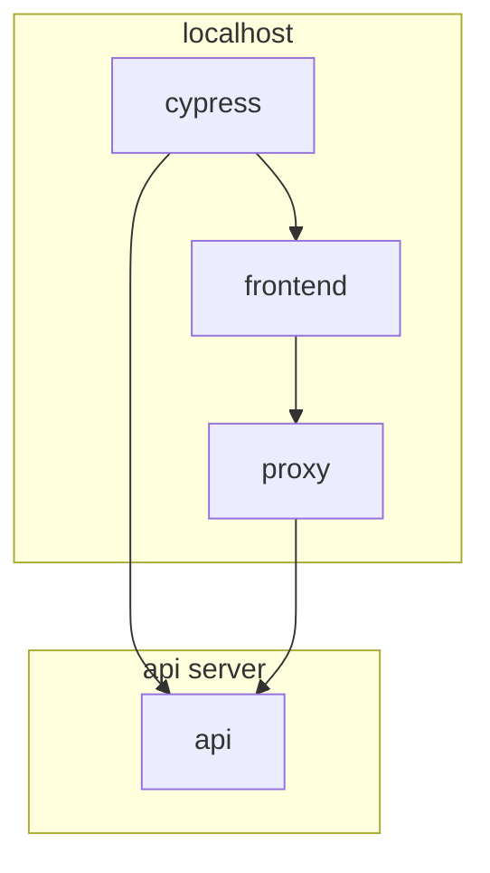

# Cypress Testing

Cypress is being used for both unit and E2E tests.

## 1. Component Testing

### Goals

- Unit test components, hooks and other functions.

### Getting started

- Run the unit tests headlessly.

  ```
  npm run cypress:run:unit
  ```

  OR

- Run the unit tests by opening Cypress and launching the browser. (For visual rendering of the components being tested)

  ```
  npm run cypress:open:unit
  ```

---

## 2. E2E Testing



### E2E Goals

- Test major user flows theough the UI such as creating, editing, and deleting.

### E2E Getting started

1. Setup Environment Variables

   | Environment Variable | Description                                                                   |
   | -------------------- | ----------------------------------------------------------------------------- |
   | E2E_SERVER           | URL of the server to run E2E tests against. Default: <https://localhost:8043> |
   | E2E_USERNAME         | username for logging into the E2E server. Default: admin                      |
   | E2E_PASSWORD         | password for logging into the E2E server. Default: admin                      |

   > Running AWX API locally defaults to <https://localhost:8043> which easily allows running E2E test against it.

2. Run the Ansible-UI.

   ```
   npm start
   ```

3. Run Cypress

   - To open the Cypress UI

   ```
   npm run cypress:open:e2e
   ```

   - To run Cypress headless

   ```
   npm run cypress:run:e2e
   ```

### NPM E2E Commands

| Command                     | Description                                                            |
| --------------------------- | ---------------------------------------------------------------------- |
| `npm run cypress`           | Runs the frontend and Cypress headless in parallel using the mock API. |
| `npm run cypress:frontend`  | Runs the frontend without opening the UI in the browser.               |
| `npm run cypress:run`       | Run Cypress headless against the mock API.                             |
| `npm run cypress:run:e2e`   | Run Cypress headless against a live API.                               |
| `npm run cypress:open`      | Run Cypress UI against the mock API.                                   |
| `npm run cypress:open:live` | Run Cypress UI against a live API.                                     |
| `npm run coverage`          | After tests have finished, view test coverage.                         |

### Testing Philosophy

#### Tests should be self contained

This is so that tests do not interfere with each other.

#### Tests should be able to be run without fixtures

This is so that it can run against not only a mock server but also a live server.

To facilitate this, there are functions to setup state using the REST api.

##### Example

Creating a team that does not exist for use in a test.

```ts
cy.requestPost<Team>('/api/v2/teams/', {
  name: 'Team ' + randomString(4),
  organization: organization.id,
}).then((team) => {
  // use created team for test
  cy.navigateTo(/^Teams$/);
  cy.clickRow(team.name);

  // cleanup the team after the test
  cy.requestDelete(`/api/v2/teams/${team.id}/`);
});
```
