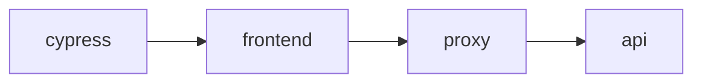

# Cypress Testing

Cypress is being used for both end-to-end tests and component tests.

## NPM Test Scripts

| Command                         | Description                                    |
| ------------------------------- | ---------------------------------------------- |
| `npm run cypress:run`           | Run E2E and component tests headless.          |
| `npm run cypress:run:e2e`       | Run E2E tests headless.                        |
| `npm run cypress:run:component` | Run component tests headless.                  |
| `npm run cypress:open`          | Open the Cypress UI to run tests.              |
| `npm run cypress:coverage`      | After tests have finished, view test coverage. |

## E2E Testing

The Cypress E2E tests run against a live backend API.



### E2E Getting started

1. Setup Environment Variables

   The E2E tests need a live API to test against. The following environment variables can be used to setup the E2E test server.

   | Environment Variable | Description                                                                         |
   | -------------------- | ----------------------------------------------------------------------------------- |
   | `CYPRESS_AWX_SERVER`         | URL of the AWX server to run E2E tests against. `Default: <https://localhost:8043>` |
   | `CYPRESS_AWX_USERNAME`       | username for logging into the AWX server. `Default: admin`                          |
   | `CYPRESS_AWX_PASSWORD`       | password for logging into the AWX server. `Default: admin`                          |

   > NOTE: Running AWX API locally defaults to <https://localhost:8043> which easily allows running E2E test against it.

2. Run the Ansible-UI frontend and proxy

   ```
   npm start
   ```

3. Run Cypress

   Run Cypress E2E tests headless

   ```
   npm run cypress:run:e2e
   ```

   Open the Cypress UI to run e2e tests

   ```
   npm run cypress:open:e2e
   ```

## Component Testing

Run Cypress component tests headless

```
npm run cypress:run:component
```

Open the Cypress UI to run component tests

```
npm run cypress:open:component
```

## Coverage

To get total coverage, run both e2e and component tests.

```
npm run cypress:run
```

Open the coverage report

```
npm run coverage
```
