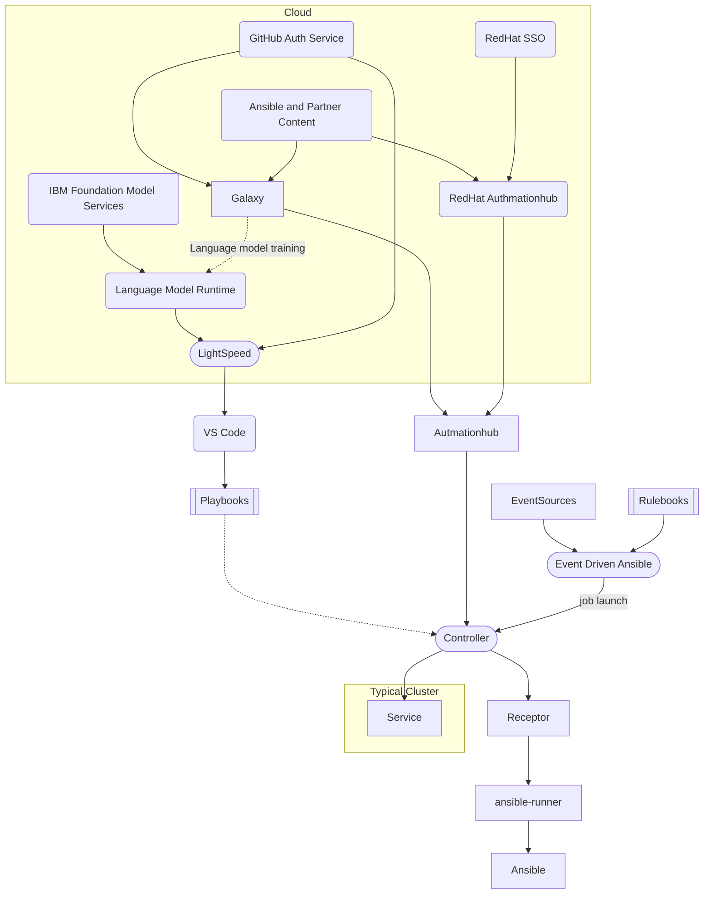

```mermaid
graph TD;
  subgraph Cloud
    FMS(IBM Foundation Model Services) --> LMR(Language Model Runtime) --> LS([LightSpeed])
    Galaxy -. Language model training .-> LMR
    GHAS ---> Galaxy
    APC(Ansible and Partner Content) --> Galaxy
    APC --> RHAH(RedHat Authmationhub)
    RHSSO(RedHat SSO) ---> RHAH
    GHAS(GitHub Auth Service) --> LS

  end

    VSC(VS Code) --> Playbooks[[Playbooks]]
    Playbooks -..-> Controller([Controller])

    LS --> VSC
  
    Galaxy ----> Autmationhub
    RHAH ----> Autmationhub
    Autmationhub --> Controller

        Controller --> Receptor
        Receptor --> ansible-runner
        ansible-runner --> Ansible


    EDA([Event Driven Ansible])
    EventSources --> EDA
    Rulebooks[[Rulebooks]] --> EDA

EDA -- job launch --> Controller


          Controller --> Service

      subgraph Typical Cluster
           Service

end
```
