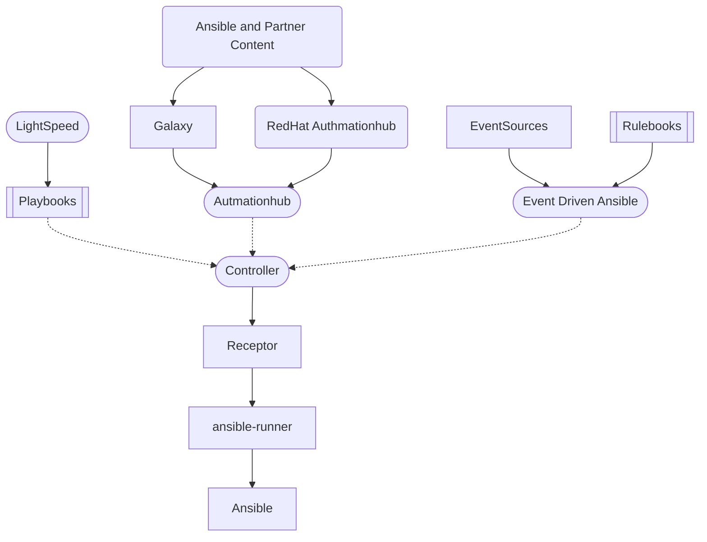

# Ansible Architecture

```mermaid
graph TD;
  APC(Ansible and Partner Content) --> Galaxy
  APC --> RHAH(RedHat Authmationhub)
  LS([LightSpeed]) --> Playbooks[[Playbooks]]
  Playbooks -.-> Controller([Controller])


  Galaxy --> Autmationhub([Autmationhub])
  RHAH --> Autmationhub
  Autmationhub -.-> Controller

  Controller --> Receptor
  Receptor --> ansible-runner
  ansible-runner --> Ansible

  EDA([Event Driven Ansible])
  EventSources --> EDA
  Rulebooks[[Rulebooks]] --> EDA

  EDA -.-> Controller

  click Controller "./Controller.md"
```
