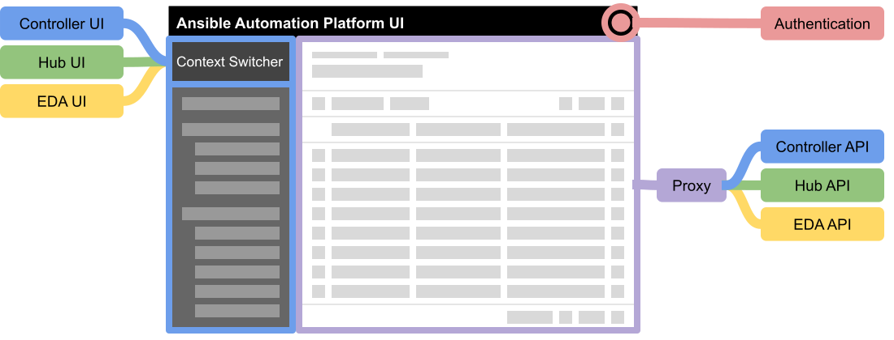

# Development

Given the need to move to a central user interface the existing user interfaces will need to be modularized. All of our user interfaces should be presented together as a single system whose options are capable of being enabled or disabled based on availability, entitlement, or authorization.

This UI will be the single visible component of the platform and should be a small lightweight service on its own, acting as a pass through to the APIs exposed by the components of the system. It will also act as the primary entrypoint for application-wide settings including Central Authentication.

## Project organization

The project is broken into three parts.

| Path       | Description                                                                          |
| ---------- | ------------------------------------------------------------------------------------ |
| /frontend  | The React web application for the Ansible UI.                                        |
| /proxy     | The proxy that hosts the web application and proxies calls to AWX and hub hosts.     |
| /framework | A framework for building applications using [PatternFly](https://www.patternfly.org) |

In addition the frontend is broken down into the structure needed for supporting both AWX, hub, and EDA.

| Path                   | Description                                           |
| ---------------------- | ----------------------------------------------------- |
| /frontend/awx          | The source code for the AWX UI.                       |
| /frontend/hub          | The source code for the hub UI.                       |
| /frontend/event-driven | The source code for the event driven architecture UI. |

Under each one of these, the directory structure should match the use navigation that is shown in the UI.

> Example: /frontend/awx/access/users

## Testing

See: [CYPRESS.md](../cypress/CYPRESS.md)
