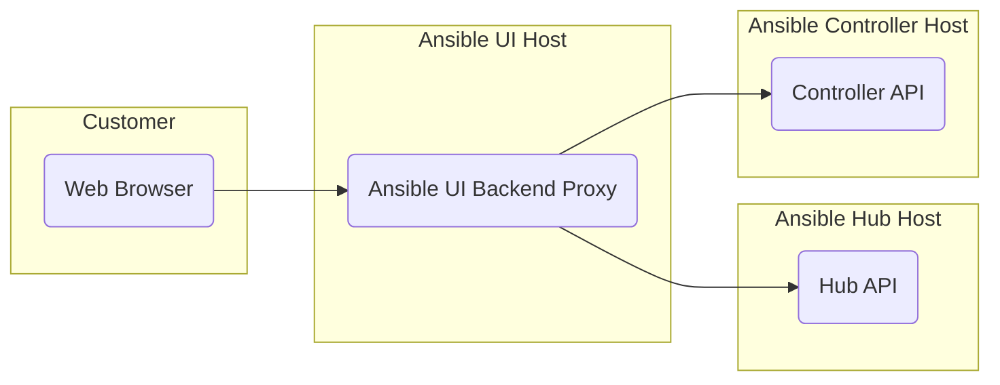

# Development

## Project organization

The project is broken into three parts.

| Path       | Description                                                                             |
| ---------- | --------------------------------------------------------------------------------------- |
| /frontend  | The React web application for the Ansible UI.                                           |
| /backend   | The proxy that hosts the web application and proxies calls to controller and hub hosts. |
| /framework | A generic framework for web applications using PatternFly and responsive design.        |

In addition the frontend is broken down into the structure needed for supporting both controller and hub.

| Path                     | Description                        |
| ------------------------ | ---------------------------------- |
| /frontend/src/controller | The source code for controller UI. |
| /frontend/src/hub        | The source code for hub UI.        |

## Architecture

One of the currrent thoughts about how to unify the Ansible Platform is to have an Ansible UI that can connect to either a hub or controller. This would enable the user to switch between their hub and contollers without having to switch their browser to a different host. This would also enable customers to have multiple controllers and to switch between them.

