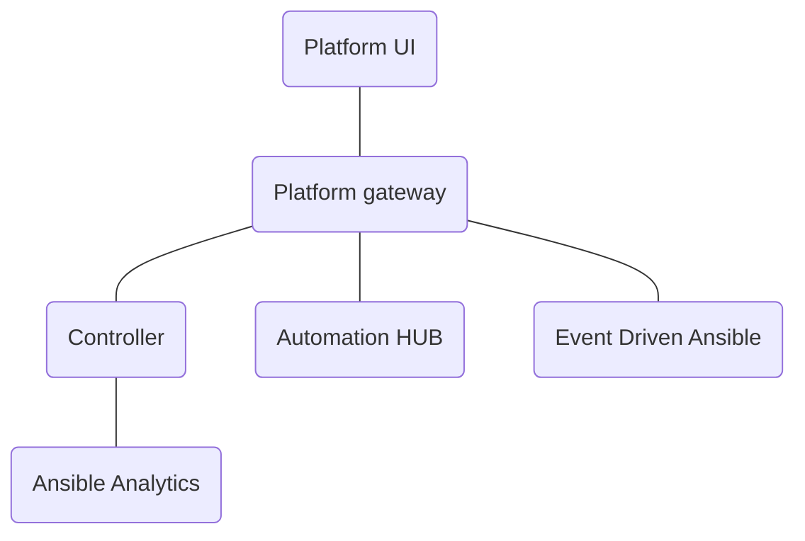

# Platform UI Architecture

The Platform UI is the unified UI for the Ansible Automation Platform. It uses the [AAP Platform](https://github.com/ansible/aap-gateway) as the backend. The platform unifies the API for the AAP products such as AWX, HUB, and EDA. It also provided centralized authentication and access management.

The Platform UI has pages for authentication, access management, settings, and dashboard. The Platform UI pulls in upstream pages from AWX, HUB, EDA, and Analytics. It uses the framework support for dynamically composing the navigation and pages to create a unified experience for the Ansible Automation Platform.
