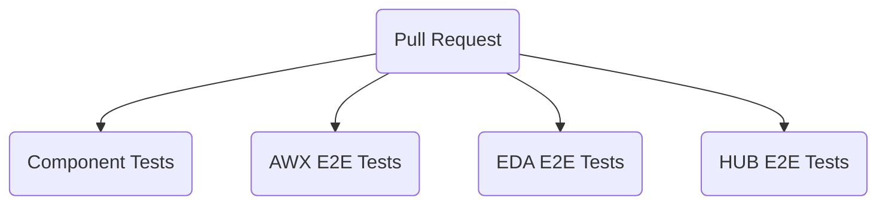
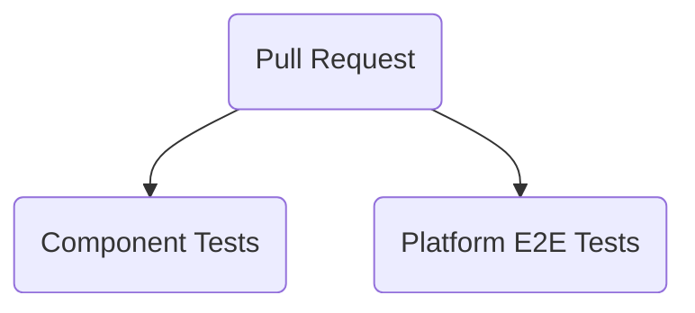

# Testing Strategy

## Overview

The testing strategy outlines the processes and workflows that ensure all code changes are thoroughly tested before being integrated into the respective repositories. This strategy applies to both the upstream open-source Ansible-UI and the downstream private AAP-UI repositories. The testing process is automated and designed to catch issues at various levels of the application to maintain high code quality and reliability.

## Ansible-UI

In the upstream open-source repository Ansible-UI, every pull request (PR) undergoes comprehensive testing before the code is merged into the repository. The testing includes component-level tests and end-to-end (E2E) tests for different product UIs to ensure the stability and functionality of the entire system.

## AAP-UI

In the downstream private repository AAP-UI, every PR is also subjected to rigorous testing before code integration. Additionally, changes from the upstream Ansible-UI repository are regularly synced to ensure consistency and up-to-date features.

## Continuous Integration and Delivery

Both repositories leverage Continuous Integration (CI) pipelines to automate the testing process. CI pipelines are triggered automatically for each PR, ensuring that no code is merged without passing all required tests. This process helps in maintaining the integrity and reliability of the codebase.

## Productization Testing

Productization Testing uses Jenkins to validate different productization targets, ensuring that the software can be deployed in various environments. This testing ensures that the product is robust, adaptable, and functional across different deployment scenarios.

### Testing Targets

- Cloud as a Service: Tests deployment and operation of the software in cloud environments, ensuring it integrates seamlessly with cloud infrastructure and services.
- Containerized: Validates the software when deployed as a container, checking for proper container orchestration, scaling, and reliability.
- Operator: Tests the deployment and management of the software via Kubernetes operators, ensuring it conforms to Kubernetes standards and operates efficiently within a Kubernetes cluster.
- RPM Deployments: Ensures the software can be packaged, distributed, and installed as RPM packages, validating the installation process, dependencies, and performance on RPM-based systems.
