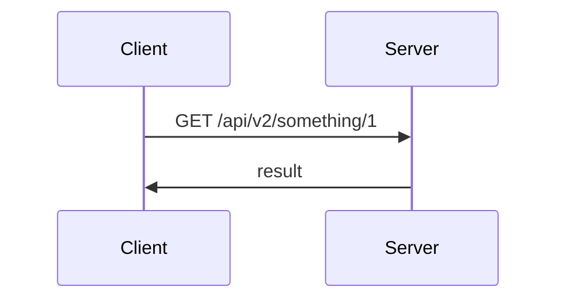
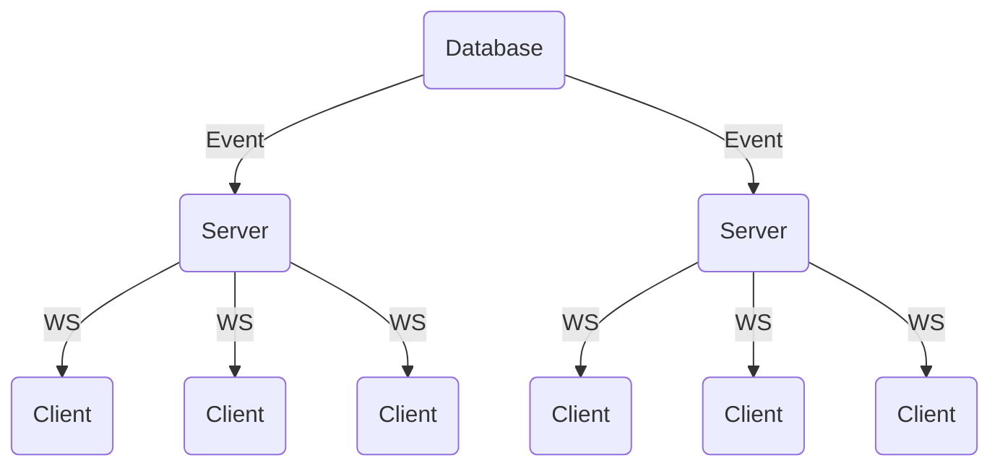
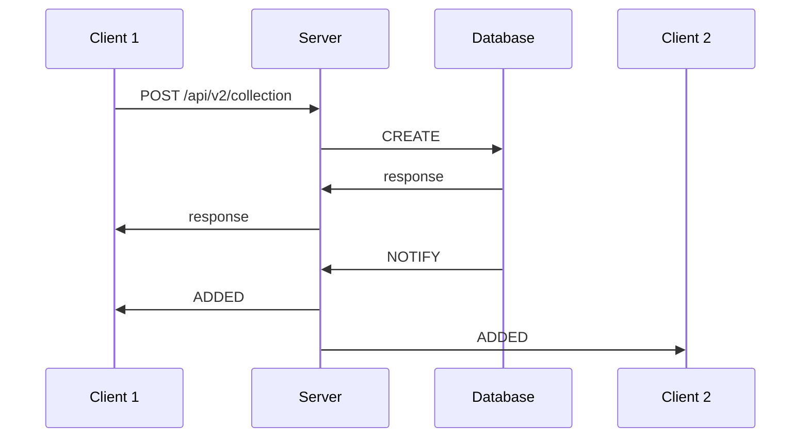

# Websockets

The WebSocket API is an advanced technology that makes it possible to open a two-way interactive communication session between the user's browser and a server. With this API, you can send messages to a server and receive event-driven responses without having to poll the server for a reply.

- [Benefits](#benefits)
  - [Websocket](#websocket)
  - [Socket.io](#socketio)
- [CRUD over Websockets](#crud-over-websockets)
  - [GET Example](#get-example)
- [Scalability](#scalability)
  - [Database events](#database-events)
    - [POST Example with database change event](#post-example-with-database-change-event)

## Benefits

### Websocket

**Bidirectional** - HTTP relies on a client request to receive a response from the server for every exchange. WebSockets allow for full-duplex bidirectional communication. This enables the server to send real-time updates asynchronously, without requiring the client to submit a request each time.

**Persistent** - Rather than establishing and terminating the connection for each client request and server response, WebSockets allow for a persistent client-server connection. After an initial HTTP “handshake,” the connection is kept alive using a “ping-pong” process, in which the server continuously pings the client for a response. The server only terminates this connection after an explicit request from the client, or implicitly when the client goes offline.

**Low Latency** - By eliminating the need for a new connection with every request, WebSockets greatly reduce the data size of each message, drastically decreasing latency. After the initial handshake, which includes standard HTTP header information, all subsequent messages include only relevant information.

**Secure** - The WebSocket Secure (WSS) protocol uses standard SSL and TLS encryption to establish a secure connection between the client and server. Using a mutually agreed-upon authorization and authentication system, the client and server can safely exchange encrypted WebSocket messages.

### Socket.io

**Performant** - In most cases, the connection will be established with WebSocket, providing a low-overhead communication channel between the server and the client.

**Reliable** - Rest assured! In case the WebSocket connection is not possible, it will fall back to HTTP long-polling. And if the connection is lost, the client will automatically try to reconnect.

**Scalable** - Scale to multiple servers and send events to all connected clients with ease.

## CRUD over Websockets

### GET Example

From the client we want to get an item from the backend.



With socket.io this can be done with a `GET` event with the collection and id as event arguments. A callback can be given as a final argument, allowing for the result to come back from the backend.

We can wrap that event with a function that returns a promise allowing for asynchronous API calls to the backend from the client.

```ts
try {
    const item = await getItem(1, "items")
    console.log(item)
} catch (err) {
    console.error(err)
    throw err
}
```

```ts
async function getItem<T>(id: number, collection: string, timeout?:number): Promise<T | undefined> {
    return new Promise((resolve, reject) => {
        socket.timeout(timeout ?? 5000).emit('GET', collection, id, (err?: Error, item?: T) => {
            if (err) {
                reject(err)
                return
            }
            resolve(item)
        })
    })
}
```

Server implementation

```ts
socket.on('GET', (collection:string, id:number, callback:(item: T | undefined)) => {
    database.get(collection, id).then(callback).catch(()=>callback())
})
```

Example CRUD API

```ts
function getItem<T>(id:number, collection:string) : Promise<T | undefined> {}
function getItems<T>(options: { page:number, sort:string, filters: Record<string,string> }, collection:string) : Promise<T[]|undefined> {}
function postItem<T>(item:T, collection:string) : Promise<T>
function putItem<T>(item:T, collection:string) : Promise<T>
function patchItem<T>(item:Partial<T> | JSONPatch[], collection:string) : Promise<T>
function deleteItem(id:number, collection:string) : Promise<boolean> {}
```

## Scalability

### Database events

Database events can be used to enable realtime notifications of changes.



| Database   | Mechanism                                                         |
| ---------- | ----------------------------------------------------------------- |
| Postgres   | [NOTIFY](https://www.postgresql.org/docs/current/sql-notify.html) |
| Redis      | Pub/Sub                                                           |
| Mongo      | Change Streams                                                    |
| Kubernetes | Watch                                                             |

#### POST Example with database change event


