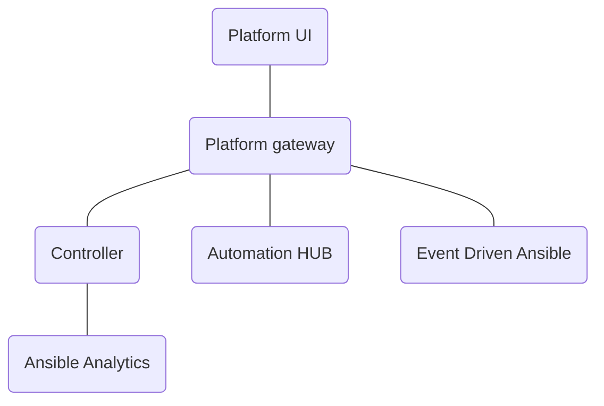

# Platform UI Architecture

The [Platform UI](https://github.com/ansible/aap-ui) is the unified UI for the Ansible Automation Platform.

- Dynamically composes the navigation and pages to create a unified experience.
- Pulls in UI pages from AWX, HUB, EDA, and Analytics.
- Contains gateway specific pages for
  - Dashboard
  - Authentication
  - Access management
  - Settings

It uses the [AAP Gateway](https://github.com/ansible/aap-gateway) as the backend.

- Unifies the APIs for the Ansible products such as AWX, HUB, and EDA
- Provides centralized authentication and access management
