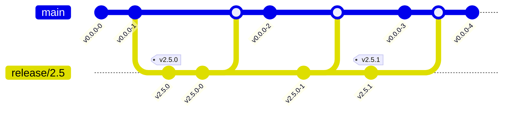

# Branching

Release branches will be named `release/2.x`.
When a release is cut, the branch will be created and tagged.
The tag will be in format `v2.5.x`.
This needs to be in the `package.json` so that semantic versioning can be used in the actions.
Changed that go into the branch will be merged back into the `main` development branch.

To branch

1. Create the branch locally `release/2.x`.
2. Update the `package.json` to have the version `2.x.x`.
3. Commit and push the branch.
4. Manually add the `v2.x.x` tag to the pushed branch.
