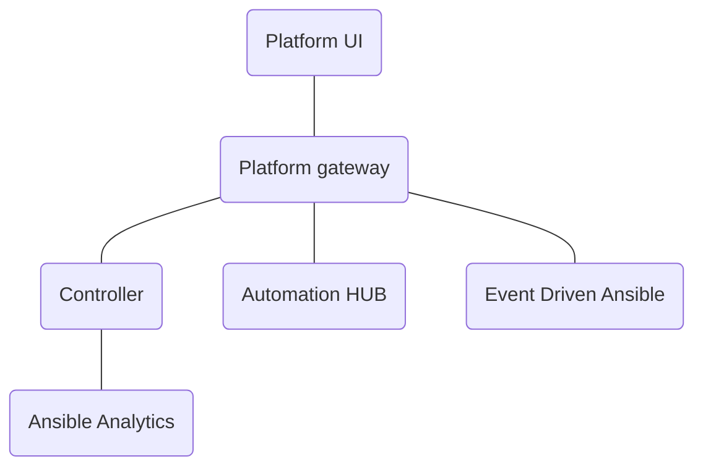

# Platform UI

The Platform UI is the unified UI for the Ansible Automation Platform. It uses the [AAP Platform](https://github.com/ansible/aap-gateway) as the backend. The platform unifies the API for the AAP products such as AWX, HUB, and EDA. It also provided centralized authentication and access management.



The Platform UI has downstream pages for authentication, access management, settings, and dashboard. The Platform UI pulls in upstream pages from AWX, HUB, EDA, and Analytics. It uses the framework support for dynamically composing the navigation and pages to create a unified experience for the Ansible Automation Platform.

## Getting Started

1. Prerequisites

   - Node 18.x (recommended)
   - NPM 8.x (recommended)

1. Setup Platform

   Follow the instructions in the [AAP Platform](https://github.com/ansible/aap-gateway) repo to get the Ansible Automation Platform running.

1. Clone the AAP-UI Repository

   ```zsh
   git clone git@github.com:ansible/aap-ui.git
   ```

1. Install Package Dependencies

   ```zsh
   npm ci
   ```

1. Setup Environment Variables

   | Environment Variable | Description                                     |
   | -------------------: | ----------------------------------------------- |
   |    `PLATFORM_SERVER` | The AAP Platform server (protocol://host:port). |

   ```zsh
   export PLATFORM_SERVER=https://localhost:443
   ```

1. Run the Platform UI

   ```zsh
   cd platform
   npm start
   ```

   This will start the Platform UI in development mode.
   It will be running on <https://localhost:4100>.
   The Platform gateway ui will talk to the platform gateway api using the `PLATFORM_SERVER` environment variable.

## Building for Production

1. Clone the AAP-UI Repository

   ```zsh
   git clone git@github.com:ansible/aap-ui.git
   ```

1. Install Package Dependencies

   ```zsh
   npm ci
   ```

1. Build the Platform UI

   ```zsh
   cd platform
   npm run build
   ```

   The built Platform UI static files should be in the `build/platform` directory.
   These should be served using a service like `nginx`.
   An example nginx config for optimal client side caching is at `/platform/platform.conf`
