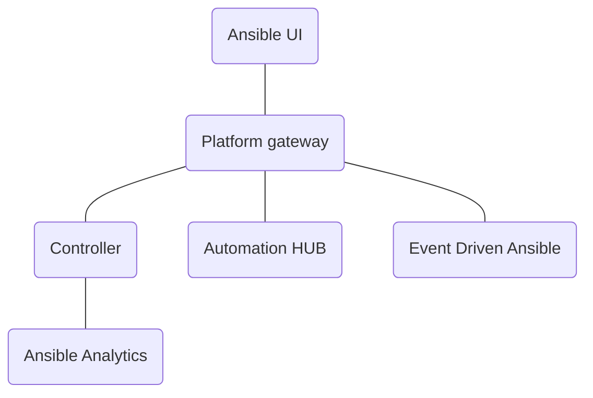

# Platform UI

The Platform UI is the unified UI for Ansible. It uses the Ansible platform as the backend. The platform unifies all Ansible services such as AWX, HUB, and EDA. It also provides centralized authentication and access management.



## Getting Started

1. Prerequisites
   - Node 18.x (recommended)
   - NPM 8.x (recommended)

1. Setup Platform

   Follow the instructions in the platform to get it running.

1. Clone the Ansible UI Repository

   ```zsh
   git clone git@github.com:ansible/ansible-ui.git
   ```

1. Install Package Dependencies

   ```zsh
   npm ci
   ```

1. Setup Environment Variables

   | Environment Variable | Description                                         |
   | -------------------: | --------------------------------------------------- |
   |    `PLATFORM_SERVER` | The Ansible Platform server (protocol://host:port). |

   ```zsh
   export PLATFORM_SERVER=https://localhost:443
   ```

1. Run the Ansible UI

   ```zsh
   cd platform
   npm start
   ```

   This will start the Ansible UI in development mode.
   It will be running on <https://localhost:4100>.
   The Platform gateway ui will talk to the platform gateway api using the `PLATFORM_SERVER` environment variable.

## Building for Production

1. Clone the Ansible UI Repository

   ```zsh
   git clone git@github.com:ansible/ansible-ui.git
   ```

1. Install Package Dependencies

   ```zsh
   npm ci
   ```

1. Build the Platform UI

   ```zsh
   cd platform
   npm run build
   ```

   The built Ansible UI static files should be in the `build/platform` directory.
   These should be served using a service like `nginx`.
   An example nginx config for optimal client side caching is at `/platform/platform.conf`
