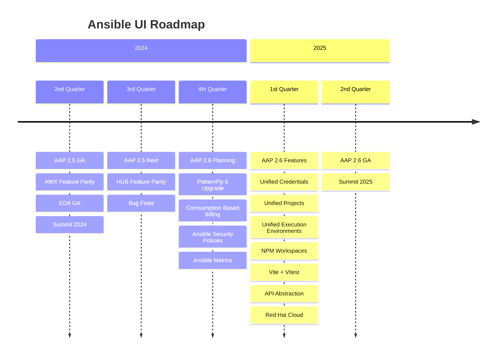

# Ansible Automation Platform UI Roadmap

- [Feature Enhancements](#feature-enhancements)
  - [Comsumption Based Billing](#comsumption-based-billing)
  - [Ansible Security Policies](#ansible-security-policies)
  - [PatternFly 6](#patternfly-6)
  - [Metrics](#metrics)
  - [Charts](#charts)
- [Technical Enhancements](#technical-enhancements)
  - [Downstream vs Upstream Bi-directional Sync](#downstream-vs-upstream-bi-directional-sync)
  - [Vite](#vite)
  - [NPM Workspaces](#npm-workspaces)
  - [Component Testing](#component-testing)
  - [Red Hat Cloud Deployment](#red-hat-cloud-deployment)
  - [API Abstraction](#api-abstraction)

## Feature Enhancements

### Comsumption Based Billing

- TBD

### Ansible Security Policies

- TBD

### PatternFly 6

- Upgrading to PatternFly 6 to leverage the latest design patterns and UI components for a modern and intuitive user interface.
- PatternFly 6 will come with a new modern look for Red Hat products plus better theming.

### Metrics

- Adding comprehensive metric tracking capabilities to monitor system health, resource utilization, and performance benchmarks.
- Add a metrics service to AAP to gather metrics over time allowing for the reporting of usage and trends.

### Charts

- Introducing interactive charts and visualizations to present data in a more intuitive and engaging manner, facilitating better data analysis and decision-making.
- Example - Job History - We can show an interactive chart allowing the user to interactivly select a time range and filter the job list to just that range. This allows the customer to have a visual view of job status and zoom into where they see errors and easily filter to those jobs.

## Technical Enhancements

### Downstream vs Upstream Bi-directional Sync

- Currently we sync from upstream to downstream.
- The issue with this is that sometimes the upstream changes break the downstream.
- It may be better to have developers work downstream and sync those changes upstream to avoid those breakages.
- Then the only thing that would go into upstream would be community contributions and when we merge those we would sunc back to downstream.

### Vite

- Implementing Vite as the build tool for faster development and improved performance.
- This reduces developerment time, testing time, and CICD pipline time.
- This will enable testing with vitest which is much faster than cypress component testing.
- Our current Cypress component testing randomly crashes because of the webpack bundling of webworkers for the monaco editor. The hope there is that moving to vite will fix that.

### NPM Workspaces

- Integration of NPM Workspaces to manage dependencies more efficiently and streamline package management.
- This will cleanup the repository and help us link from one project to another efficently.

### Component Testing

- If we get Vite as the bundler we should be able to leverage vitest for speeding up our component testing vs Cypress. This should make testing easier and help our velocity.

### Red Hat Cloud Deployment

- Enabling seamless deployment on Red Hat Cloud platforms for enhanced scalability and reliability.
- Building upon the npm workspaces we can leverage the Red hat insights SDK to build versions of the applications for Red Hat cloud.

### API Abstraction

- Knowing now after the requirements after the 2.5 release we can enhance our framework to have an API abstraction over each resource type. This will enhance our UI components. We can E2E test that abstraction and then test much of the product against mocks that mock that API abstraction. This will futher stabality testing and promote development velocity.
